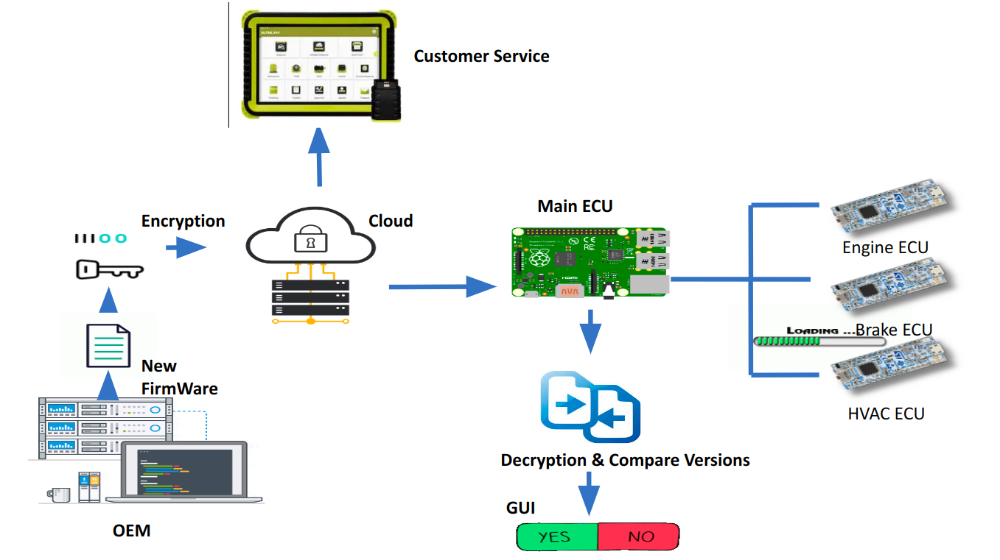
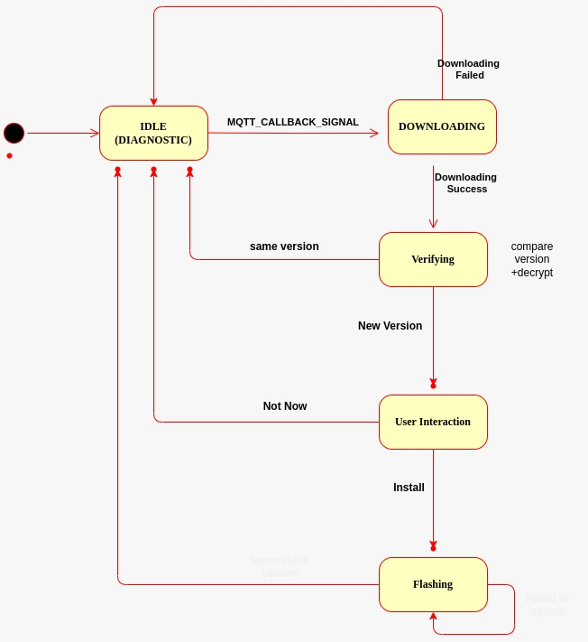
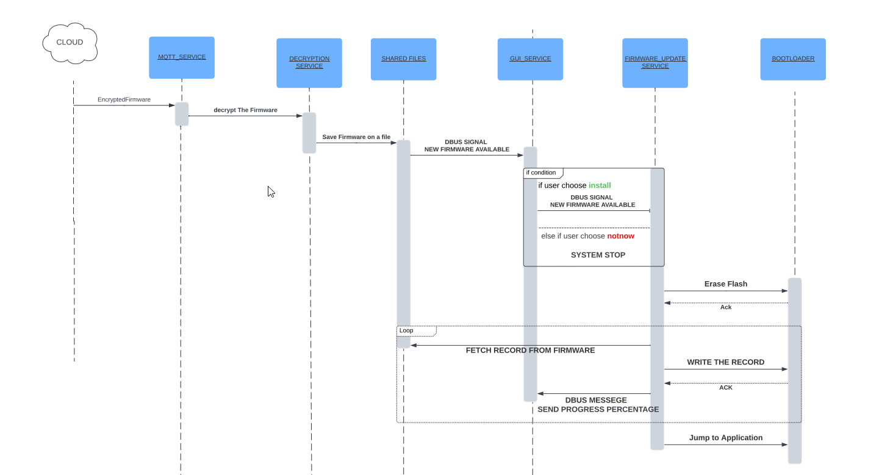
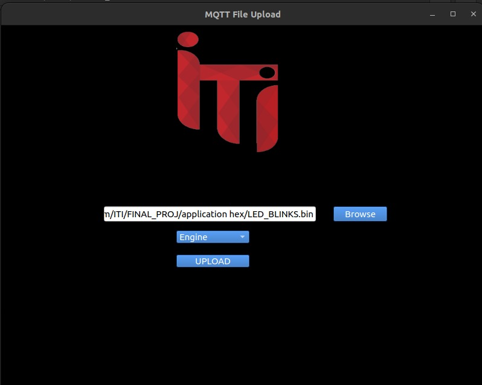
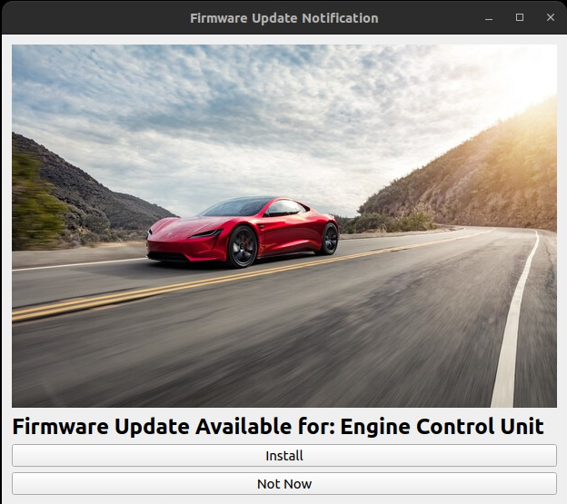

## System Overview:

Infotainment Diagnosync System is an intricately integrated automotive control, diagnostics, and cloud-based update management system that seamlessly coordinates firmware updates, vehicle diagnostics, and cloud connectivity. This system operates via a network of Graphical User Interfaces (GUIs), each tailored to specific functions within the complex ecosystem of vehicular operations.

Firmware Over-The-Air (FOTA) and Control System:

Within this system, the FOTA and control mechanisms are responsible for managing firmware updates and vehicle operations, facilitated through an interconnected array of modules and GUIs:

Desktop Application GUI: Orchestrates the update process, encrypting firmware updates in .bin format and publishing them via MQTT to dedicated topics.
Main ECU (Raspberry Pi) and 3 STM32F401CC ECUs: These components host services, decrypting received updates and signaling the GUI Services for user interaction.
FOTA Flashing GUI: Engages users by presenting installation choices for specific ECUs and communicates user preferences to the Firmware Update Service.
Firmware Update Service: Communicates via I2C with the ECUs, initiating the flashing process and updating the GUI Service on progress through D-Bus signals.
Vehicle Diagnostic and Monitoring System:

This facet focuses on real-time analysis of sensor data and remote accessibility, encompassing:
ECUs & Sensor Network: The main ECU and three STM32F401CC units manage various sensors, providing vital data on engine health, brake systems, and environmental conditions.
I2C Communication: Facilitates seamless data exchange among ECUs, enabling sensor readings and system control.
Diagnostic Dashboard GUI: Offers graphical representations of sensor data, providing real-time insights into the vehicle's operational parameters.
Cloud Connectivity: Facilitates remote diagnostics, enabling customer service to access sensor readings and ECUs for remote diagnostic procedures through cloud-based interfaces.
The Infotainment diagnosync System exemplifies the Vehicle-to-Cloud (V2C) concept, ensuring smooth data flow from the vehicle to cloud-based services, enhancing vehicle performance and diagnostic capabilities.

This comprehensive system streamlines firmware updates, diagnostic monitoring, and remote access, delivering comprehensive vehicle control, health maintenance, and an enhanced user experience.

*************************************************************************************************************************************
Module Descriptions for Infotainment diagnosync System

1. Desktop Application GUI
Description: This graphical user interface serves as the central control hub for initiating firmware updates. It encrypts the firmware updates in .bin format and publishes them via MQTT to specific topics for distribution.
Functionalities:
Encryption of firmware updates.
Publishing updates via MQTT to dedicated topics.
User interaction for initiating the update process.

2. Main ECU (Raspberry Pi) and 3 STM32F401CC ECUs
Description: These ECUs serve as the core components in the system, hosting services that manage firmware updates, decryption, and signaling user interactions.
Functionalities:
Receiving and decrypting firmware updates.
Signaling the GUI Services for user interaction.
Exchange of sensor data and control mechanisms.

3. FOTA Flashing GUI
Description: This GUI interacts with users, presenting installation choices for specific ECUs and relaying user selections to the Firmware Update Service.
Functionalities:
User prompt for choosing ECU update installations.
Communication of user preferences to the Firmware Update Service.

4. Firmware Update Service
Description: This service communicates via I2C with the ECUs, initiating the flashing process and updating the GUI Service on progress through D-Bus signals.
Functionalities:
Initiating the flashing process for specific ECUs.
Updating GUI Services on flashing progress.

5. Diagnostic Dashboard GUI
Description: This graphical interface provides representations of sensor data, offering real-time insights into the vehicle's operational parameters.
Functionalities:
Real-time graphical representations of sensor data.
Visualization of vehicle operational parameters.

6. Customer Service GUI
Description: Enables remote access for diagnostics, allowing customer service to access sensor readings and ECUs for remote diagnostic procedures through the cloud.
Functionalities:
Remote access for diagnostics.
Interaction with sensor readings and ECUs for remote diagnostic procedures.

Formore details abous Modules Descriptions check the README.txt files on sourcecode folders

*************************************************************************************************************************************
3- Workflow diagram

*************************************************************************************************************************************
4- User interaction

Check the demo video describing practical how to use the system

*************************************************************************************************************************************

Network Recommendations:

1- use two different brokers for Diagnostic and Fota system

2-make sure that raspberry pi has astable connection with internet (ethernet)

*************************************************************************************************************************************
HARDWARE RECOMMENDATION

1- make sure that i2c bus working with pull up resistor 4.7k - 10k ohm and 3.3 voltage
2- make sure that both i2c buses do not share the same vcc (every bus takes power from different source)
3- make sure that raspberry pi working on a proper voltage 

*************************************************************************************************************************************

RECOMMENDATION FOR UPDATES
1- CHANGINC I2C BUS : by CAN bus or any effecient communication protocole
2-Smart ECU Health Reports: Generate comprehensive reports detailing the health and status of each ECU, aiding in proactive maintenance and system optimization.
3-Personalized Infotainment Settings: Develop a system that adapts infotainment settings based on driver preferences or historical usage patterns.
4-Add Sensors and Driver assisting system rather than potentionmeters

*************************************************************************************************************************************
HOW TO START WITH THE PROJECT 

1- CHECK EVERY README.txt on Every Folders and follow the instructions (change paths , download packages ,etc..)

